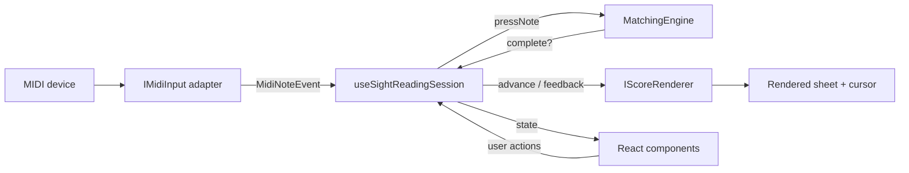

# Sight Reading Trainer

A **100% halucinated** MIDI-driven sight-reading trainer for the browser. Load a MusicXML score, connect a
MIDI keyboard, and a cursor advances as you play the correct notes — highlighting
mistakes in red. Built primarily for **Android Chrome**, but works in any Chromium
browser that supports the Web MIDI API.

This document is aimed at contributors. It explains what each part of the code is
**for** and how the pieces fit together, so you can add features without having to
reverse-engineer the whole app first. It intentionally avoids line-level implementation
detail — read the source (and its doc comments) for that.

## Features

- **Connect MIDI devices** via two selectable transports (USB / Web MIDI and
  Bluetooth / Web Bluetooth), chosen in a device modal opened from a status dot.
- **Load MusicXML** (`.xml`, `.musicxml`, or compressed `.mxl`) from a file. A file that
  cannot be parsed shows an error banner.
- **Generate practice material** in the app, no files needed:
  - **Sheets** — random diatonic melodies with configurable key, time signature, measure
    count, pitch range, durations, rests, ties, accidentals and chords.
  - **Scales** — deterministic scale drills with configurable key, scale degrees, motion
    direction (up, down, up + down, down + up), octave span per direction, note value,
    time signature, starting octave per staff, and single or grand staff.
- **Sheet rendering** with a cursor that starts on the first note and spans both staves
  of a grand staff. The view auto-scrolls to keep the current measure centred.
- **Play-to-advance**: the cursor moves on only when every note it highlights has been
  played (chords are cumulative and order-independent). A wrong note flags red.
- **Two play modes**: **Wait** (default, described above) and **Flow**, where the cursor
  always advances — near-simultaneous presses are judged as one chord attempt, and
  positions played incorrectly get a persistent orange mark for later review. Marks clear
  on restart, on loading a score, via a toolbar action, or by replaying the position
  correctly.
- **Exact-octave matching** (MIDI note numbers must match).
- **Advance controls**: step by **note**, **beat**, or **measure**, with a **skip**
  multiplier (advance N units at a time) applied to both manual and auto-advance.
- **Manual navigation**: move the cursor forward/back or restart at any time.

## Getting started

```bash
npm install
npm run dev
```

The dev server runs over **HTTPS** (self-signed cert via `@vitejs/plugin-basic-ssl`),
because Web MIDI and Web Bluetooth require a *secure context*.

- On the same machine, open the `https://localhost:5173/` URL and accept the certificate
  warning.
- **On an Android device**, open the `https://<your-LAN-IP>:5173/` URL shown in the
  terminal and accept the certificate warning. HTTPS is required for the phone to treat
  the page as a secure context.

### Scripts

| Script | Purpose |
| --- | --- |
| `npm run dev` | Start the Vite dev server (HTTPS). |
| `npm run build` | Type-check and produce a production bundle in `dist/`. |
| `npm run preview` | Serve the production build locally. |
| `npm test` | Run the unit tests (Vitest). |
| `npm run test:e2e` | Run the end-to-end tests (Playwright; starts the dev server itself). |
| `npm run typecheck` | Type-check the app without emitting. |
| `npm run typecheck:e2e` | Type-check the end-to-end tests. |
| `npm run lint` | Lint the project. |

## Testing

Two complementary suites:

- **Unit tests (Vitest)** cover `src/domain/` — the pure matching and MIDI-parsing
  logic. Specs live next to the code (`*.test.ts`).
- **End-to-end tests (Playwright)** live in `e2e/` and drive the real app in headless
  Chromium: they replace the Web MIDI API with a fake input device
  (`e2e/helpers.ts`) and send raw MIDI bytes through the real adapter → parser →
  session → renderer pipeline, then assert on the rendered sheet (cursor position,
  feedback colours, persistent error marks). The suite covers every feature:
  - `loading.spec.ts` — default scale generation, file loading, invalid-file error banner,
    piece completion
  - `generate-sheet.spec.ts` — the sheet generator dialog, validation, persistence,
    playability of constrained output
  - `generate-scale.spec.ts` — the scale generator dialog: motions, degree/key selection,
    grand staff, note value and meter, validation, persistence
  - `midi-device.spec.ts` — device modal, connect/disconnect, status dot
  - `wait-mode.spec.ts` — blocking on wrong notes, octave sensitivity, feedback badge
  - `flow-mode.spec.ts` — gesture judging, persistent marks and their clearing rules
  - `chords.spec.ts` — grand-staff chords in both modes
  - `navigation.spec.ts` — manual navigation, skip multiplier, measure mode + highlight
  - `auto-scroll.spec.ts` — scroll-follow behaviour, including recentring when only a
    measure's ledger lines are clipped, using a long test-only score in `e2e/fixtures/`
    (not bundled with the app)

  One-time setup:

  ```bash
  npx playwright install chromium
  ```

  `npm run test:e2e` starts the HTTPS dev server automatically. What the fake device
  cannot cover — real MIDI hardware, Bluetooth pairing, and input latency feel on an
  Android phone — still needs a manual pass on a real device.

## Browser support

The Web MIDI API is supported in Chrome/Chromium (desktop and Android), Edge, Opera and
Samsung Internet. It is **not** available in Firefox for Android or Safari/iOS. Web
Bluetooth has similar Chromium-only support. Use Chrome on Android for the intended
experience.

## Architecture

The guiding principle is **thin interfaces with swappable implementations**: MIDI input,
score rendering, and note-matching are each isolated behind a small contract, and a
single React hook wires them together. UI and pure logic never depend on a concrete
technology (Web MIDI, OSMD, VexFlow), so any one of them can be replaced in isolation.

### Data flow



A note event flows from the device adapter into the session hook, which feeds it to the
matching engine. When the current position is satisfied the hook tells the renderer to
advance the cursor; wrong notes are pushed to the renderer as feedback. The UI is a pure
projection of the hook's state plus callbacks back into it.

### Layers and their purpose

```
src/
  domain/            Pure, framework-free logic (unit-tested; no React/DOM/OSMD)
    midi/            Normalises raw MIDI + BLE-MIDI bytes into MidiNoteEvent; note names
    matching/        MatchingEngine (wait mode) and GestureMatcher (flow mode) — decide
                     when a position is correctly played
    score/           Shared enums/types (advance mode, feedback state)
    generation/      MusicXML generators: random practice sheets and scale drills
  input/             MIDI input abstraction (the "where notes come from" boundary)
    IMidiInput.ts               Transport-agnostic contract (list/connect/onNote)
    AbstractMidiInput.ts        Shared listener/state plumbing for adapters
    WebMidiInputAdapter.ts      Web MIDI implementation (USB + OS-paired)
    WebBluetoothMidiAdapter.ts  Web Bluetooth (BLE-MIDI) implementation
    MidiInputFactory.ts         Creates the adapter for a chosen transport
  rendering/         Score rendering abstraction (the "how the sheet is drawn" boundary)
    IScoreRenderer.ts           Engine-agnostic contract (load/cursor/feedback/scroll)
    OsmdScoreRenderer.ts        OpenSheetMusicDisplay implementation
  session/           Orchestration
    useSightReadingSession.ts   Hook that owns input + engine + renderer and app state
  components/        Mobile-first React UI (CSS Modules); presentational, reads the hook
e2e/                 Playwright end-to-end tests (fake MIDI device + real pipeline)
```

- **`domain/`** is the stable core: no dependency on React, the DOM, MIDI APIs, or the
  notation engine. Everything here is easy to unit-test and safe to reuse. Put
  technology-independent rules (matching behaviour, message parsing) here.
- **`input/`** hides the MIDI transport behind `IMidiInput`. Adapters translate a
  transport's raw data into the shared `MidiNoteEvent` shape.
- **`rendering/`** hides the notation engine behind `IScoreRenderer` — loading a score,
  moving and querying the cursor, colouring feedback, and scrolling. Anything OSMD- or
  VexFlow-specific lives only in `OsmdScoreRenderer`.
- **`session/`** is the single place that knows about all three collaborators. The hook
  exposes plain state (connection status, current step, feedback, advance settings, …)
  and callbacks (`goNext`, `loadFile`, `setAdvanceMode`, `setSkip`, …) to the UI.
- **`components/`** are thin and presentational: they render the hook's state and call
  its callbacks. Device selection lives in a modal; a coloured status dot summarises the
  connection.

### Key contracts

- **`IMidiInput`** — discover devices, connect/disconnect, and emit `MidiNoteEvent`s.
  New transports implement this.
- **`IScoreRenderer`** — load a score and drive the cursor (`next`/`previous` by a
  granularity and count, `resetCursor`, `getCurrentStep`, `setFeedback`,
  `setAdvanceMode`). New notation engines implement this.
- **`MatchingEngine`** / **`GestureMatcher`** — pure state machines that accept played
  notes and report whether the current position is complete or wrong (per note in wait
  mode; per timed gesture in flow mode). Change *how correctness is judged* here.

## Adding a feature

Common changes and where they belong:

- **Support another MIDI transport** — add an `IMidiInput` implementation (extend
  `AbstractMidiInput`), add it to the `MidiTransport` union, register it in
  `MidiInputFactory`, and add a toggle in `MidiDevicePanel`.
- **Swap or add a notation engine** (e.g. Verovio) — add an `IScoreRenderer`
  implementation and construct it in the session hook. No UI or domain changes needed.
- **Add a cursor granularity or navigation option** — extend `AdvanceMode` in
  `domain/score/types.ts`, handle it in `OsmdScoreRenderer` (the cursor-stepping logic),
  and surface it in the toolbar's advance menu.
- **Change matching rules** (e.g. ignore octave, timing tolerance) — edit
  `MatchingEngine` and its tests; nothing else should need to change.
- **Add UI or app state** — expose new state/callbacks from `useSightReadingSession` and
  render them in a component.

When adding to `domain/`, add or update the Vitest specs next to the file
(`*.test.ts`). The renderer and adapters rely on browser APIs, so they are not
unit-tested; behaviour that reaches the rendered sheet (cursor movement, feedback,
marks, toolbar controls) belongs in the Playwright suite in `e2e/`. Hardware-specific
behaviour still needs a manual check on a real device.

## Notes on behaviour

- **Matching** is evaluated per note-group (a vertical slice of simultaneous notes).
  In wait mode chords are cumulative and order-independent; the position advances once
  every required note has been played. In flow mode notes pressed within a ~100 ms window
  form one gesture, judged as a set: an exact match advances immediately, anything else
  (wrong, extra, or missing notes) advances when the window closes and marks the position.
- **Advance settings** combine a granularity (note / beat / measure) and a skip count.
  A step moves `count` units of the selected granularity; the same setting applies to the
  manual buttons and to auto-advance on correct play (default note × 1 = classic
  note-by-note). In measure mode a translucent measure highlight is shown.
- **Auto-scroll** keeps the current measure centred, and only scrolls when any part of the
  measure (ledger lines included) is not fully visible. The scroll is a short smooth
  animation (ease-out, at most ~400 ms); users with `prefers-reduced-motion` get an
  instant jump instead.
- **Wrong-note highlight** clears as soon as a correct required note is played or the
  step changes. Tie-continuation notes and grace notes are not required to be re-pressed.

## Security

- No backend; MusicXML is parsed entirely in the browser.
- Web MIDI access is requested **without SysEx** to keep the permission scope minimal.

## Known limitations

- The production JS bundle is dominated by OpenSheetMusicDisplay/VexFlow. It is cached
  after first load; code-splitting the renderer is a possible future optimisation.
- The end-to-end tests fake the MIDI device, so real hardware quirks (Bluetooth
  pairing, latency, device hot-plugging) can only be verified on a real
  browser/device.
